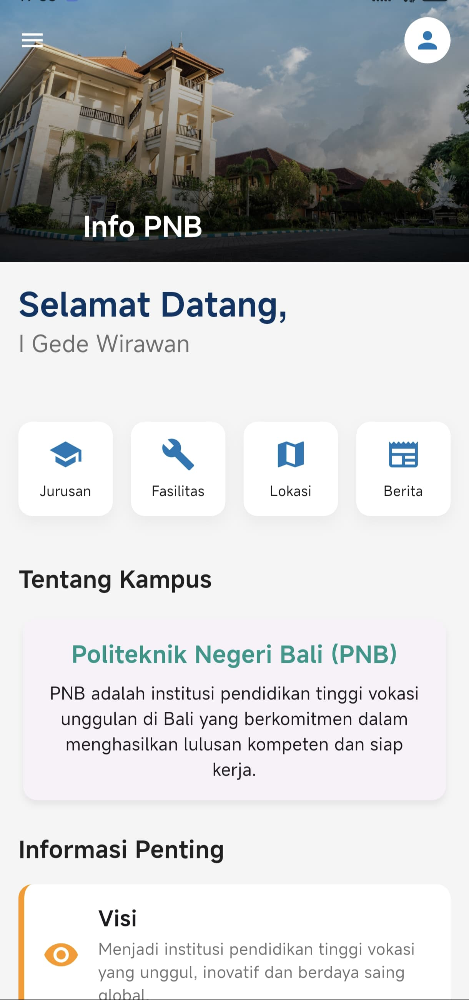
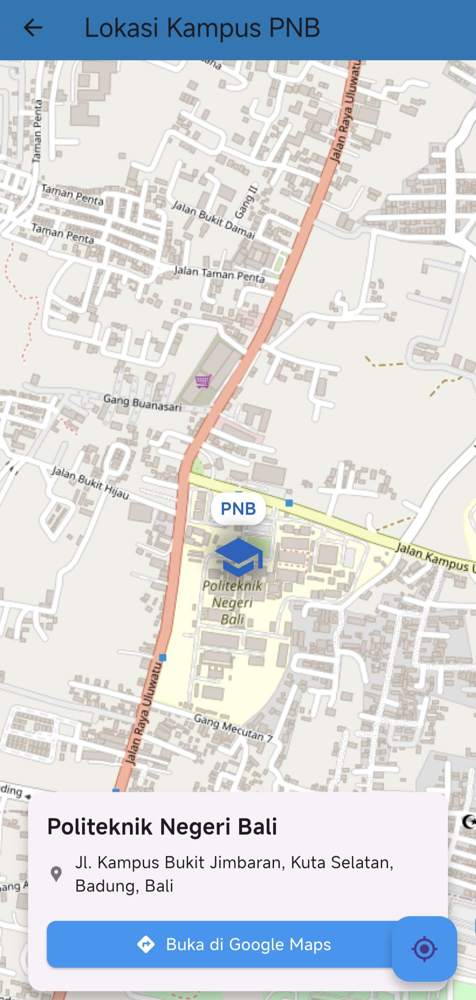
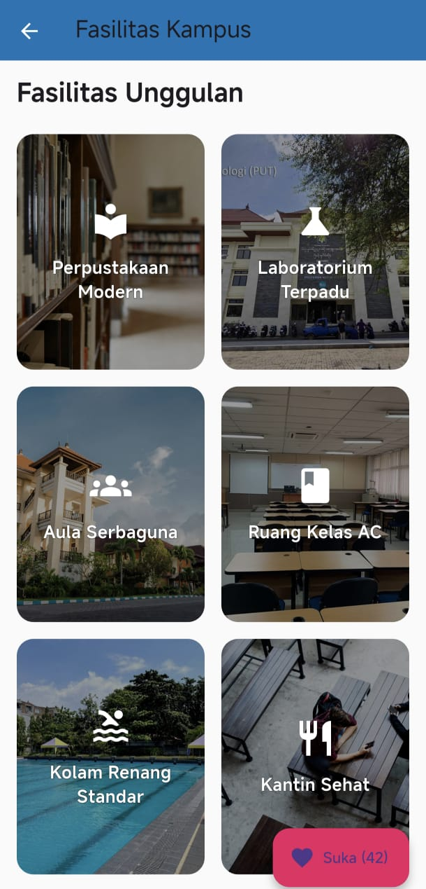

<h3>Aplikasi Informasi Kampus PNB ✨</h3>


Sebuah aplikasi mobile fungsional yang dibangun menggunakan Flutter untuk menyediakan informasi lengkap dan interaktif seputar Politeknik Negeri Bali (PNB). Proyek ini dikembangkan sebagai bagian dari Proyek Akhir Semester (UAS) untuk mendemonstrasikan penerapan konsep-konsep kunci dalam pengembangan aplikasi mobile.

**✨ Fitur Utama** <br>
Aplikasi ini dirancang untuk menjadi sumber informasi terpusat bagi mahasiswa dan calon mahasiswa PNB, dengan fitur-fitur sebagai berikut: <br>
- **Beranda Dinamis:** Tampilan beranda yang modern dengan SliverAppBar, menu akses cepat, dan widget cuaca real-time.<br>
- **Informasi Jurusan:** Daftar program studi yang tersedia, disajikan dalam kartu visual yang menarik.<br>
- **Galeri Fasilitas:** Tampilan fasilitas kampus dalam bentuk grid interaktif yang menampilkan detail saat diklik.<br>
- **Peta Kampus Interaktif (GPS):**
Menampilkan lokasi kampus di peta OpenStreetMap.
Mendeteksi lokasi pengguna saat ini dan menampilkannya di peta.
Tombol untuk membuka lokasi di Google Maps untuk navigasi.<br>
- **Berita dan Pengumuman (API):**
Mengambil berita terkini seputar pendidikan dari API eksternal (NewsAPI.org).
Menampilkan berita dalam daftar yang bisa di-scroll, dengan tautan ke artikel asli.<br>
- **Sistem Saran & Masukan (CRUD SQLite):**
Form untuk mengirimkan saran dan masukan.
Data disimpan secara lokal di perangkat menggunakan database SQLite.
- **Fungsionalitas CRUD penuh:** pengguna dapat Melihat, Memperbarui, dan Menghapus saran yang telah mereka kirim.<br>
- **Navigasi Modern:** Menggunakan Navigation Drawer yang dipersonalisasi untuk berpindah antar halaman dengan mudah.<br>

**📸 Tangkapan Layar (Screenshots)**

| Beranda | Jurusan | Peta Lokasi |
| :---: | :---: | :---: |
|  |  |  |
| **Fasilitas** | **Berita** | **Riwayat Saran** |
|  |  |  |

**🛠️ Teknologi dan Dependensi** <br>
Proyek ini dibangun menggunakan **Flutter (versi 3.x) dan Dart.** 
 Berikut adalah daftar dependensi utama yang digunakan:
- **State Management:** StatefulWidget & setState untuk state lokal.<br>
- **Database Lokal:**
**sqflite:** Implementasi SQLite untuk penyimpanan data persisten.
**path:** Helper untuk menemukan direktori database di perangkat.
- **Komunikasi Jaringan (API):**
**http:** Untuk membuat HTTP request ke API eksternal.
- **Layanan Lokasi (GPS) & Peta:**
**geolocator:** Untuk mengakses data GPS dari perangkat.
**flutter_map:** Widget untuk merender peta interaktif dari OpenStreetMap.
**latlong2:** Utilitas untuk mengelola data koordinat.
- **Interaksi Eksternal:**
**url_launcher:** Untuk membuka URL di browser atau aplikasi eksternal (seperti Google Maps).
- **UI & Animasi:**
**flutter_staggered_animations:** Untuk memberikan animasi yang elegan pada daftar dan grid. <br>

**🏗️ Arsitektur dan Alur Kerja**<br>
Aplikasi ini mengadopsi pendekatan pemisahan tanggung jawab (separation of concerns) dengan memisahkan UI, logika bisnis, dan model data.
Struktur File
```
lib/
├── api_service.dart          # Logika untuk mengambil data dari API
├── app_drawer.dart           # Widget untuk Navigation Drawer
├── berita_model.dart         # Model data untuk artikel berita
├── daftar_saran_page.dart    # UI untuk menampilkan daftar saran (Read, Delete)
├── db_helper.dart            # Logika untuk interaksi database SQLite
├── detail_page.dart          # UI untuk halaman detail jurusan
├── fasilitas_page.dart       # UI untuk halaman fasilitas
├── form_saran_page.dart      # UI untuk form saran (Create, Update)
├── home_page.dart            # UI untuk halaman beranda
├── lokasi_page.dart          # UI untuk peta lokasi GPS
├── main.dart                 # Titik masuk aplikasi
├── pengumuman_api_page.dart  # UI untuk halaman berita/pengumuman
├── saran_model.dart          # Model data untuk saran
└── weather_widget.dart       # Widget UI untuk cuaca
```
<br>


**🚀Instalasi dan Konfigurasi** <br>
Untuk menjalankan proyek ini di lingkungan lokal Anda, ikuti langkah-langkah berikut:
**1. Prasyarat:**
- Pastikan Anda telah menginstal Flutter SDK.
- Siapkan emulator Android atau perangkat fisik.

**2. Clone Repositori:**
```
git clone https://github.com/wiraputra/aplikasi_informasi_kampus.git
cd aplikasi_informasi_kampus
```

**3. Dapatkan Dependensi:**
```
flutter pub get
```

**4. Konfigurasi API Keys:**
- **NewsAPI:** Buka file **lib/api_service.dart** dan ganti placeholder **_apiKey** dengan API Key valid dari NewsAPI.org. 
- **OpenWeatherMap API:** Buka file **lib/weather_service.dart** dan ganti placeholder **_apiKey** dengan API Key valid dari OpenWeatherMap.

**5. Konfigurasi Izin Lokasi:**
Pastikan izin lokasi telah ditambahkan di 
**android/app/src/main/AndroidManifest.xml** (untuk Android) 
**ios/Runner/Info.plist** (untuk iOS). <br>

**6. Jalankan Aplikasi:**
```
flutter run
```

**👨‍💻 Kontributor**
Proyek ini dikembangkan oleh:
**Nama: I Gede Wirawan**
Dibuat sebagai bagian dari pemenuhan tugas Proyek Akhir Semester (UAS).

